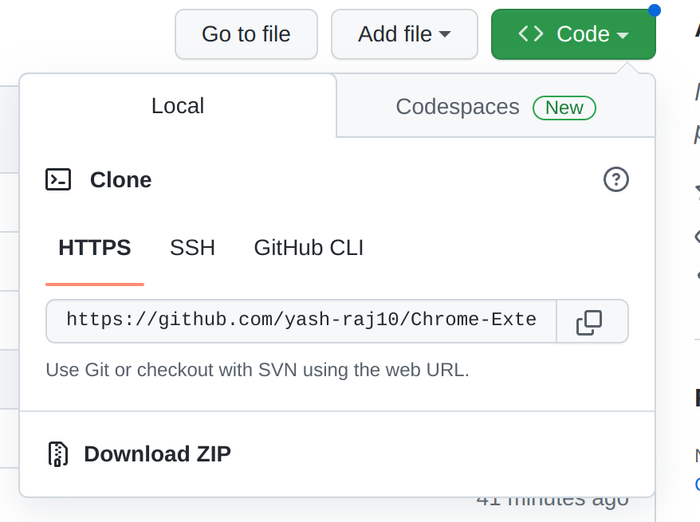
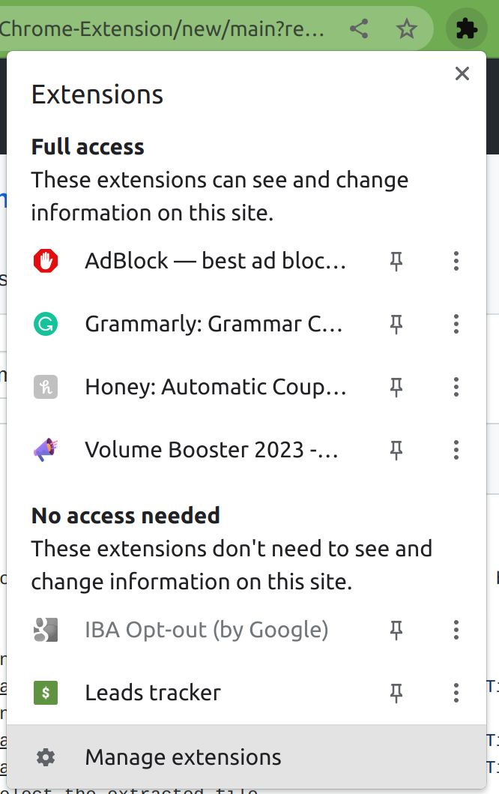
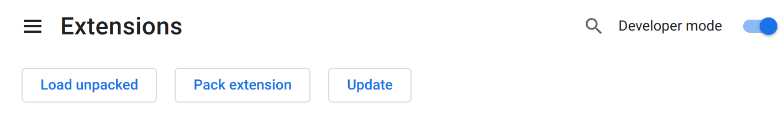

# Chrome-Extension
# What's its usage ?
- you can use it to save your current tab link in your LocalStorage and can be also used to save independent links.

# How to use it ?
- just download the Zip file and extrct it
- 
- go to manage extension and enable developer option
- 
- 
- click on Load Unpacked and select the extracted file
- now it's ready to use!
